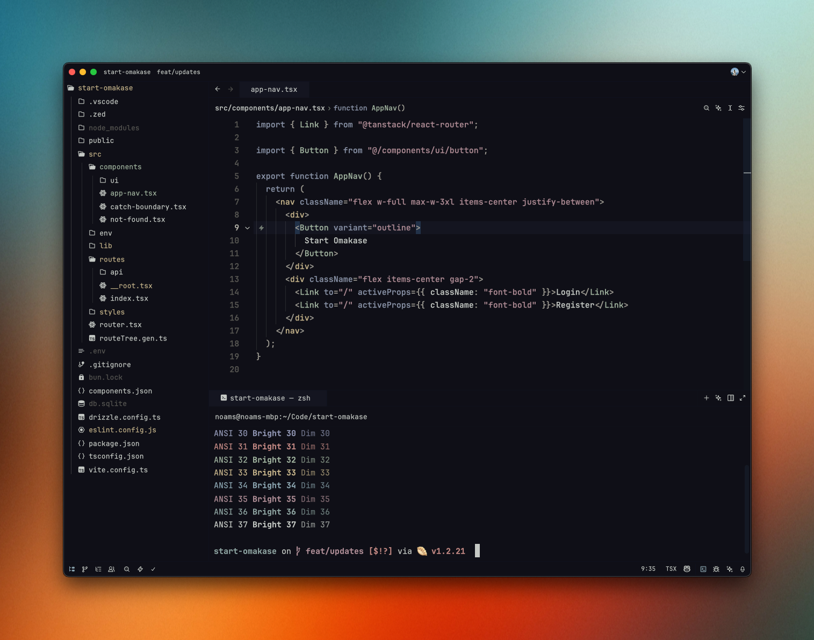
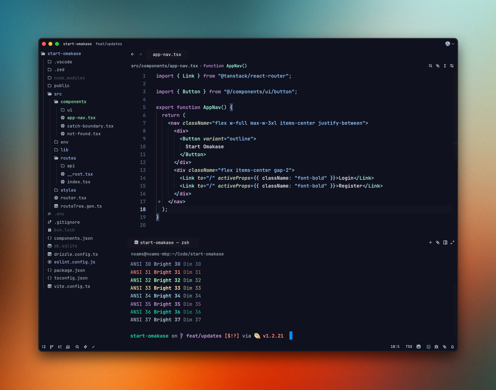

# 🍣 Themes Omakase

A collection of my custom themes, **inspired by great theme design work and tuned to my own aesthetic preferences**.
Each theme lives in its own folder, with versions for different IDEs and accompanying screenshots.

Currently available for:

- **Zed**
- **VSCode**
- **Warp**
- **OpenCode**

---

## 🌌 Vika

A grounded, **earthy utilitarian** dark theme, built as a fusion of two inspirations:
- [**Vesper**](https://github.com/raunofreiberg/vesper) by _Rauno Freiberg_
- [**Kanagawa.nvim**](https://github.com/rebelot/kanagawa.nvim) by _Tommaso Laurenzi (rebelot)_



➡️ [See the theme folder](./vika)

---

## 🌙 In Bed by 8pm

A cozy, dreamy dark theme with **pastel accents** and a relaxed vibe.
Based on *In Bed by 7pm* by [Sarah Drasner](https://github.com/sdras), extended and refined with my own palette and tweaks.



➡️ [See the theme folder](./in-bed-by-8pm)

---

## 🌲 Neverforest

A warm, comfortable dark theme with **natural green tones** and a cozy vibe.
Based on [**Everforest**](https://github.com/sainnhe/everforest) by _Sainnhe Park_, with a darker background and refined palette.


➡️ [See the theme folder](./neverforest)

---

## 📥 Installation

### Zed
Download the desired theme's `.json` file and place it in Zed's config path:
`~/.config/zed/themes` on macOS and Linux

Then restart Zed and select the theme

### VSCode / Cursor
Download the `.vsix` file from the theme's folder and install it using `Extensions: Install from VSIX` or directly via:
```
code --install-extension vika-*.vsix
```

### Warp
Download the desired theme's `.yaml` file and place it in Warp's themes directory:
`~/.warp/themes` on macOS and Linux

Then restart Warp and select the theme from Settings → Appearance → Theme

### OpenCode
Download the desired theme's `.json` file and place it in OpenCode's themes directory:
`~/.config/opencode/themes` on macOS and Linux

Then restart OpenCode and select the theme from settings

---

## 📣 Contributing

PRs and suggestions welcome!
If you tweak, port, or remix any of these themes, let me know — I’d love to showcase forks and variants.

---

## 📜 License

[MIT](./LICENSE)